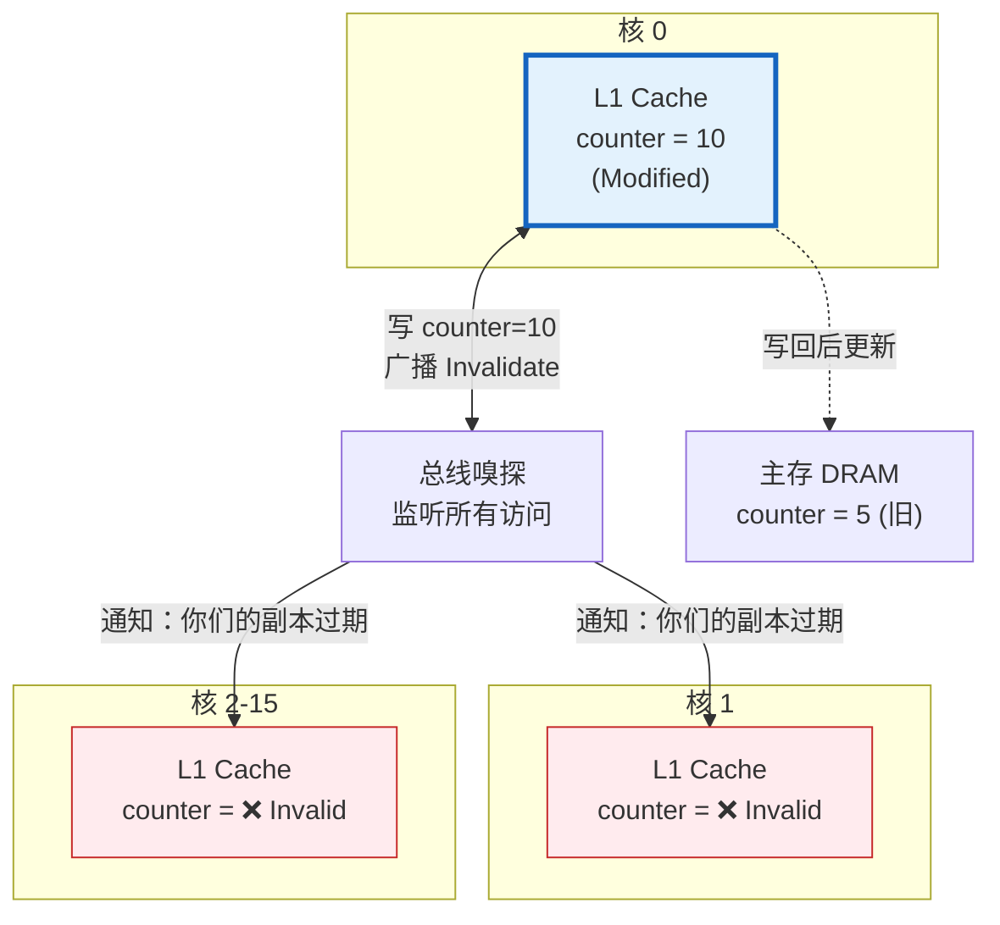
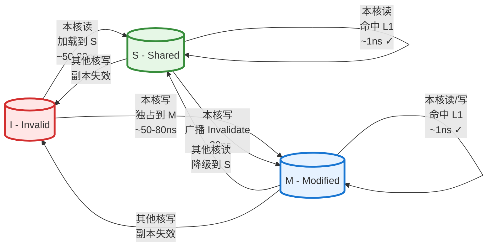
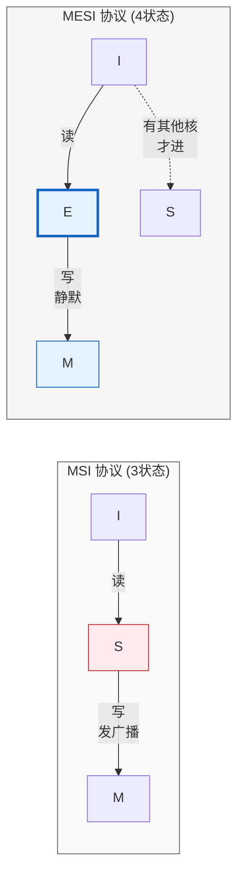
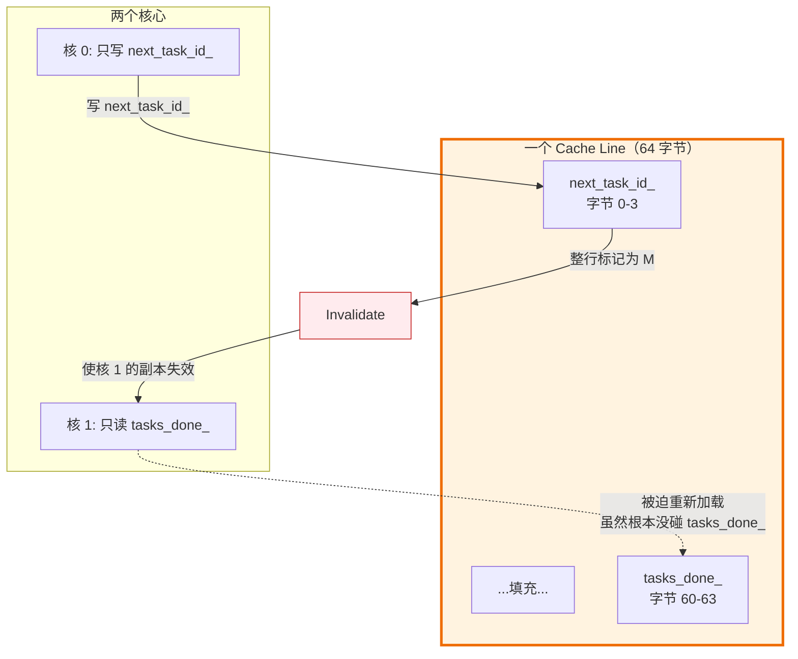
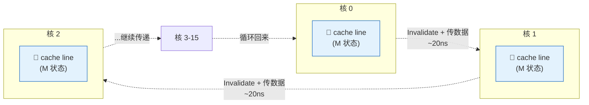

# 理论 04：缓存一致性（Cache Coherence）

> 一句话：多核 CPU 每个核都有自己的缓存副本，当一个核修改数据时，其他核的缓存如何保持同步——这决定了你的 atomic 操作到底有多快。

## 为什么你需要学这个

Lab 2 中 16 个 Worker 线程共享 `next_task_id_`、`tasks_done_` 等变量。每次一个 Worker 执行 `fetch_add`，其他 15 个 Worker 缓存中的副本就失效了。这个"失效 → 重新获取"的过程有多慢，直接决定了 Spinning 版线程池的性能上限。

更隐蔽的是 **False Sharing**——两个看似无关的变量因为在同一个 cache line 里，互相拖慢对方——这是 Lab 2 性能调优中最常见也最难发现的问题。

---

## 核心概念

---

### 概念 1：缓存一致性问题（Coherence Problem）

**定义**

一句话：**多核 CPU 各自有缓存，一个核改了数据，其他核可能读到旧值——缓存一致性协议就是用来保证"所有人看到的是同一份最新数据"的机制。**

**直觉**

> **一句话记住问题**
> 
> 16 个人各自抄了一份同样的文档，一个人改了却不告诉大家，其他人还在看旧版 → 错误！

```
现实类比：微信群公告

  场景：老板在群里发通知 "counter = 5"
  
  核 0：把公告截图保存到本地相册（L1 cache）
  核 1：也把公告截图保存到本地相册
  主存：微信群原始消息
  
  问题出现：
    核 0 私下修改自己的截图："counter = 10"
    核 1 不知道，还看自己的旧截图："counter = 5" → 错误！
    主存里还是 "counter = 5" → 也是旧值！
    
  缓存一致性协议 = 群里的 "@所有人 我已更新" 功能：
    核 0 修改时自动 @所有人："counter 已改，你们的截图作废"
    核 1 下次看 counter 时，必须从群（主存/核 0）重新获取
```

**机制**

硬件通过**总线嗅探（Bus Snooping）**实现——所有核心像坐在会议室里，谁发言（读写数据）都被其他人听到，相关的人自动做出反应。



**在 Lab 2 中的体现**

```
场景：16 个 Worker 抢 next_task_id_

时间线 ──────────────────────────────────────────────►

Worker 0:  fetch_add ──→ 独占 M ──→ 其他 15 核变 I
                           ↓
Worker 1:  发现 I ──→ 重新获取 ──→ 独占 M ──→ 其他 15 核变 I
                           ↓
Worker 2:  发现 I ──→ 重新获取 ──→ 独占 M ...

结果：一个 cache line 在 16 个核之间"弹跳"，每次弹跳 ~20ns
      这是 Spinning 版线程池的原子操作瓶颈
```

| 操作 | 状态变化 | 延迟 | 是否通知其他核 |
|:---:|:---|:---:|:---:|
| 核 0 写 | I → M | ~50ns | ✅ 发 Invalidate |
| 核 1 写 | I → M | ~50ns | ✅ 发 Invalidate |
| ... | ... | ... | ... |
| **16 核串行** | **I ↔ M 反复** | **~20-50ns/次** | **每次都广播** |

---

### 概念 2：MSI 协议

**定义**

MSI 协议是最基础的缓存一致性协议，为每个缓存行（cache line）维护三种状态：Modified（已修改，本核独占且与主存不一致）、Shared（共享，多核持有一致的只读副本）、Invalid（无效，本核的副本已过期）。任何状态转换都通过总线事务触发，保证全局一致性。

**直觉**

```
三种状态的现实类比——"共享文档编辑"：

  Invalid(I)：你没有这个文档（或你的版本已过期）
              → 要看就得去服务器下载最新版
  
  Shared(S)：你有最新版文档的只读副本，别人也有
             → 可以直接读，不能改
             → 类似 Google Docs 的"仅查看"权限
  
  Modified(M)：你正在编辑这个文档，且只有你有最新版
               → 可以随意读写（速度最快，不需要网络通信）
               → 别人的副本都标记为过期（Invalid）
               → 类似"独占编辑锁"
```

**机制**

MSI 三态模型：每个 cache line 在同一时刻只能处于以下一种状态



**状态定义速查**

| 状态 | 含义 | 读写权限 | 延迟 |
|:--:|:---|:---:|:---:|
| **I** Invalid | 无效/过期 | ❌ 不可访问 | 需重新加载 |
| **S** Shared | 共享只读 | ✅ 读 / ❌ 写 | ~1ns (命中) |
| **M** Modified | 独占已修改 | ✅✅ 读写最快 | ~1ns (命中) |

**关键转换规则**

- **I → S/M**: 需要跨核/跨内存获取数据，**慢 (~50-80ns)**
- **S → M**: 需发送 Invalidate 使其他核副本失效，**中等 (~20ns)**  
- **M ↔ S**: M 状态持有者需响应其他核的请求，提供数据
- **→ I**: 所有状态都可能因其他核写入而退回 Invalid

关键转换解读：


| 当前状态 | 事件   | 新状态 | 动作                                 |
| ---- | ---- | --- | ---------------------------------- |
| I    | 本核读  | S   | 从主存/其他核加载，~50-80ns                 |
| I    | 本核写  | M   | 从主存/其他核加载并独占，~50-80ns              |
| S    | 本核读  | S   | 直接读 L1，~1ns（最快路径）                  |
| S    | 本核写  | M   | 发送 Invalidate 给所有持有该 line 的核，~20ns |
| M    | 本核读  | M   | 直接读 L1，~1ns（最快路径）                  |
| M    | 本核写  | M   | 直接写 L1，~1ns（最快路径）                  |
| M    | 其他核读 | S   | 提供数据给请求核，自己降级为 S                   |
| M/S  | 其他核写 | I   | 本核副本失效                             |


**在 Lab 2 中的体现**

当 Worker 线程执行 `next_task_id_.fetch_add(1)` 时：

```
Worker 0 的视角：
  cache line 状态 = Invalid（其他 Worker 刚改过）
  → 通过一致性协议获取最新值（I → M），~20-50ns
  → 执行 fetch_add（M 状态下读写，~1ns）
  → 完成，cache line 状态 = Modified

Worker 1 的视角：
  cache line 状态 = Invalid（Worker 0 刚把它改成 M，本核被 Invalidate 了）
  → 同样需要获取最新值（I → M），~20-50ns
  → ...

结论：每次 fetch_add 的实际延迟 ≈ 20-50ns（I → M 转换）
     而不是 1ns（如果是独占的 M 状态下）
     16 个 Worker 串行轮流，每秒只能完成约 20-50M 次 fetch_add
```

---

### 概念 3：MESI 协议

**定义**

MESI 协议在 MSI 三态基础上增加 Exclusive（独占未修改）状态。一句话概括：**MESI 解决了 "独占读" 场景下的无效广播问题——当只有一个核心读数据时，标记为 E（独占但未改），后续写操作可直接静默转为 M，无需通知其他核。**

**直觉**

> **一句话记住区别**
> 
> MSI：读 → 共享(S) → 写 → 广播 Invalidate → 转修改(M)  
> MESI：读 → 独占(E) → 写 → 静默转修改(M)，**无广播**

```
现实类比：借书

  MSI 模式：
    你借了一本书 → 图书馆标记"此书有人借"（Shared）
    你想在书上做笔记 → 必须广播"所有人把你们的副本扔掉！"
    但实际上只有你一个人有这本书...白喊了
    
  MESI 模式：
    你借书时，图书馆检测到"只有你借" → 标记"仅你持有，未涂改"（Exclusive）
    你想做笔记 → 直接写，无需广播（因为本来就没别人有）
    → 省了一次大喇叭通知
```

**机制**

| 协议 | 状态数 | "先读后写" 自己的变量 | 是否需要广播 |
|:--:|:--:|:---|:---:|
| **MSI** | 3 | I → S → M | ✅ 必须 Invalidate |
| **MESI** | 4 | I → **E** → M | ❌ **无需广播** |

```
关键场景对比（只有一个核访问变量 x）：

  时间线 ──────────────────────────────────────────────►
  
  MSI：
    核 0:  读 x  ──→ S状态 ──→ 写 x ──→ 广播 Invalidate ──→ M状态
                         ↑                              
                         └────── 浪费！明明只有我一个 ────┘
                         
  MESI：
    核 0:  读 x  ──→ E状态 ──→ 写 x ──→ 静默转 M
                         ↑
                         └────── E状态记录"仅我持有未修改"────┘
```

**MESI vs MSI 本质区别图解**



**四态速查卡**

| 状态 | 独占？ | 与内存一致？ | 核心场景 |
|:--:|:---:|:---:|:---|
| **M** | ✅ 独占 | ❌ 已改 | 刚写完，还没刷回内存 |
| **E** | ✅ 独占 | ✅ **未改** | **MESI 优化点**：读时只有你一人 |
| **S** | ❌ 共享 | ✅ 一致 | 多人只读 |
| **I** | ❌ 无效 | - | 过期或从未加载 |

**在 Lab 2 中的体现**

> **记住这个结论**：
> - `next_task_id_`（16 核争抢）→ 永远 I↔M，**E 状态无用**
> - `per_thread_counter`（仅 1 核访问）→ I→E→M，**省一次广播**

```
变量类型          是否进入 E 状态        性能收益
─────────────────────────────────────────────────────
next_task_id_     ❌ 16 核竞争，无法独占    无

tasks_done_       ❌ 多核更新进度          无

loop_counter      ✅ 仅本核读写            有（消除 S→M 广播）
```

**一句话总结**：MESI 的 E 状态只对"真正独占"的变量有效。Lab 2 的热点变量都是多核共享的，所以 MSI vs MESI 对你的原子操作性能**无差别**——但别让你的局部变量因为 False Sharing 失去 E 状态的机会！

---

### 概念 4：False Sharing（伪共享）

**定义**

一句话：**不同的变量恰好在同一个 cache line（64字节）里，你写你的、我读我的，但因为硬件只能追踪"整行"，我的缓存被你的写操作误伤失效——这就是"假共享"。**

**直觉**

> **一句话记住问题**
> 
> 两个人在一张大桌子两端各写各的文档，你一写字，管理员就过来说"整张桌子被改了，你的文档可能过期了"——其实根本没碰你的文档！

```
现实类比：酒店保险箱

  场景：酒店有一个大保险箱（cache line = 64 字节），分成 16 个小格子
  
  房客 A 的护照  → 放在格子 0  
  房客 B 的现金  → 放在格子 15
  
  问题：
    房客 A 打开保险箱取护照 → 前台登记"保险箱使用中"
    房客 A 改完护照放回去  → 前台广播"该保险箱已更新，所有人来确认"
    房客 B 明明只关心格子 15 的现金，也被迫跑一趟前台确认
    
  False Sharing = 保险箱的"整箱锁定"机制，无法只锁定单个格子
  
  解决方案：
    给每个房客单独一个保险箱（alignas(64)）→ 互不干扰
```

**图示：False Sharing 如何发生**



**代码示例**

```cpp
struct TaskSystem {
    std::atomic<int> next_task_id_;    // offset 0-3   ┐
    std::atomic<int> tasks_done_;      // offset 4-7   ├─ 同一个 cache line（64 bytes）
    bool stop_;                        // offset 8     │
    int num_total_tasks_;              // offset 12-15 ┘
};
```

这些变量在同一个 64 字节的 cache line 里。当 Worker A 修改 `tasks_done_` 时，Worker B 正在读 `next_task_id_` 的缓存也被 Invalidate 了，即使 B 根本不关心 `tasks_done_`。

**量化影响：**

```
没有 False Sharing（各在独立 cache line）：
  fetch_add(next_task_id_) 延迟 ≈ 20ns（只有竞争同一变量的核受影响）

有 False Sharing（在同一 cache line）：
  fetch_add(next_task_id_) 延迟 ≈ 20ns（竞争）
  + tasks_done_ 的修改也触发 next_task_id_ 的 Invalidation
  + 总延迟可能增加 50-100%
```

**修复方案：**

```cpp
// 方案 1：手动填充（Padding）
struct alignas(64) TaskSystem {
    alignas(64) std::atomic<int> next_task_id_;    // 独占 cache line 0
    alignas(64) std::atomic<int> tasks_done_;      // 独占 cache line 1
    alignas(64) bool stop_;                        // 独占 cache line 2
    int num_total_tasks_;
};

// 方案 2：结构体对齐
struct PaddedAtomic {
    alignas(64) std::atomic<int> value;
};
PaddedAtomic next_task_id_;
PaddedAtomic tasks_done_;
```

**在 Lab 2 中的体现**

Lab 2 的评分标准是 PERF <= 1.2（不超过参考实现的 120%）。如果你的实现基本正确但性能差了一点点，False Sharing 往往是首要排查对象。

实际建议：

```
Lab 2 的规模（16 线程）下，False Sharing 的影响通常在 10-30% 范围内。
如果你的 PERF 在 1.0-1.3 之间，是否修复 False Sharing 取决于具体测试。
如果 PERF > 1.5，问题不在 False Sharing，而在算法设计层面。

优先级：先确保算法正确且逻辑合理，最后再考虑 False Sharing 优化。
```

> **RDMA 映射**：RDMA 的 QP 结构（Send Queue、Receive Queue、Completion Queue）在内存中通常经过精心的 cache line 对齐。RNIC 通过 DMA 写入 CQ Entry 时，如果 CQE 和应用层频繁访问的数据在同一 cache line 上，就会产生 False Sharing。这就是为什么 `ibv_cq` 的内部布局需要仔细设计。

---

### 概念 5：Cache Line Bouncing（缓存行弹跳）

**定义**

一句话：**同一个 cache line 在多个 CPU 核之间来回"踢皮球"，每次传递都要Invalidate对方的缓存——这就是高并发 atomic 操作变慢的根本原因。**

**直觉**

> **一句话记住问题**
> 
> 一本只有一本的书，16 个人轮流看，每次传手都要 20ns——大部分时间花在"递书"，而不是"看书"。

```
现实类比：接力棒

  场景：16 个跑者传递一根接力棒（cache line）
  
  传递过程：
    跑者 0 拿到棒 ──→ 跑者 1 要跑 ──→ 0 传给 1（20ns）
    跑者 1 拿到棒 ──→ 跑者 2 要跑 ──→ 1 传给 2（20ns）
    ...
    
  一轮 16 人 = 16 × 20ns = 320ns
  每人实际"跑步"（计算）可能只要 1ns
  但"传棒"（一致性开销）占了 99% 时间！
  
  理想情况（每人有自己的书）：
    16 人同时读自己的书 ──→ 吞吐率 = 16G/秒
    接力棒模式              ──→ 吞吐率 = 50M/秒
    
  差距：**320 倍！**
```

**机制**



**Lab 2 热点变量 bouncing 排名**

| 排名 | 变量 | 触发频率 | 性能影响 |
|:---:|:---|:---:|:---:|
| 🥇 | `next_task_id_` | 每个 task 一次 | **最严重** |
| 🥈 | `tasks_done_` | 每个 task 一次 | 严重 |
| 🥉 | `mutex` 状态 | 每次 lock/unlock | 中等（粒度可粗化） |
| 4 | `condition_variable` | 每次 notify/wait | 低（频率远低于 task） |

**在 Lab 2 中的体现**

> **核心对比：Spinning vs Sleeping 的 bouncing 差异**

```
Spinning 版（16 Worker 空转）：
  ┌─────────────────────────────────────────────────────┐
  │ Worker 0: fetch_add ──→ M ──→ Worker 1 抢 ──→ I   │
  │ Worker 1: fetch_add ──→ M ──→ Worker 2 抢 ──→ I   │
  │ ... 无限循环，即使没 task 也在 bounce！             │
  │ 主线程: spin-wait tasks_done_ → 又多一个竞争者      │
  └─────────────────────────────────────────────────────┘
  结果：CPU 100% + 缓存污染 + 无效 bouncing

Sleeping 版（智能等待）：
  ┌─────────────────────────────────────────────────────┐
  │ 无任务时: 所有 Worker 睡眠 → 零 bouncing            │
  │ 有任务时: 仅实际 task 数量次 fetch_add → 按需 bounce │
  │ 主线程: cv.wait() 睡眠 → 不参与竞争                 │
  └─────────────────────────────────────────────────────┘
  结果：轻量任务性能提升 5-10 倍
```

| 场景 | Spinning 版 bouncing 次数 | Sleeping 版 bouncing 次数 |
|:---|:---:|:---:|
| 轻量 task（执行 10ns）| 无限（CPU 空转）| = task 数量 |
| 重量 task（执行 1ms）| = task 数量 | = task 数量 |
| 无 task 时 | 无限 ❌ | 0 ✅ |

---

## 关键结论速查卡

| 概念 | 一句话总结 | Lab 2 应用 |
|:---|:---|:---|
| **Cache Coherence** | 多核各自有缓存，需要协议保证"所有人看同一最新值" | `next_task_id_` 被 16 核争抢 |
| **MSI 协议** | 三态：I(无效) → S(共享只读) → M(独占可写) | 每次 `fetch_add` 触发 I↔M 转换 |
| **MESI 协议** | 新增 E(独占未改)，解决"只有自己用"场景的无效广播 | Lab 2 热点变量用不上 E 状态 |
| **False Sharing** | 不同变量在同一 cache line，互拖后腿 | `alignas(64)` 隔离变量 |
| **Cache Line Bouncing** | 同一行在多核间"踢皮球"，每次 20ns | Spinning 版空转时无限 bouncing |

**性能优化优先级**

```
1. 算法正确性（必须对）
2. 同步逻辑设计（Sleeping vs Spinning）
3. 锁粒度优化（减少竞争）
4. False Sharing（最后微调 10-30%）
```

**一句话记住**

> Spinning 版慢 ≠ CPU 浪费，而是 cache line 在 16 核之间来回"踢皮球"，每次传递都要 20ns！
> Sleeping 版快 = 没任务时零 bouncing，有任务时才按实际数量 bounce。

---

## 自测

**[判断题 1]**  
在 MSI 协议中，一个 cache line 可以同时在两个核的缓存中处于 Modified 状态。

<details>
<summary>答案</summary>

**错误** ❌  
M 状态 = "只有我独占且最新"，两个核同时 M 会违背一致性。任何时刻最多一个核能持有 M 状态。
</details>

---

**[判断题 2]**  
如果一个变量只被一个线程读写，它永远不会因为 cache coherence 产生额外开销。

<details>
<summary>答案</summary>

**不完全正确** ⚠️  
- ✅ 变量独占 cache line → 无开销（始终在 M/E 状态）  
- ❌ 变量与其他线程变量同处一行 → **False Sharing**！你的缓存会被别人的写操作误伤 Invalidate
</details>

---

**[计算题]**  
Lab 2 Spinning 版：16 Worker，task 执行 100ns，`fetch_add` bouncing 延迟 30ns。实际吞吐率和效率损失？

<details>
<summary>答案</summary>

**瓶颈分析：**
- 计算吞吐率：16 / 100ns = **160M tasks/sec**
- fetch_add 吞吐率：1 / 30ns = **33M/sec**（串行瓶颈！）
- **实际吞吐率 = 33M/sec**（由 fetch_add 决定）

**效率损失：**  
33M / 160M = **20.6%** ⚠️  

> 结论：当 task 很轻（100ns）时，atomic 操作（30ns）成为严重瓶颈。这就是 `super_super_light` 测试中 Spinning 版惨败的原因。
</details>

---

**[代码预测题]**  
以下代码正确吗？有性能问题吗？

```cpp
struct Counters {
    std::atomic<int> per_thread_count[16];  // 每线程一个计数器
};
```

<details>
<summary>答案</summary>

**正确性：✅ 正确**  
每个线程只写自己的元素，无数据竞争。

**性能：❌ 严重 False Sharing！**  
`16 × 4 字节 = 64 字节`，恰好填满一个 cache line！16 个线程互相 Invalidate。

**修复：**
```cpp
struct alignas(64) PaddedCounter {
    std::atomic<int> count;
};
PaddedCounter per_thread_count[16];  // 各独占一行
```
性能提升 **5-10 倍**。
</details>

