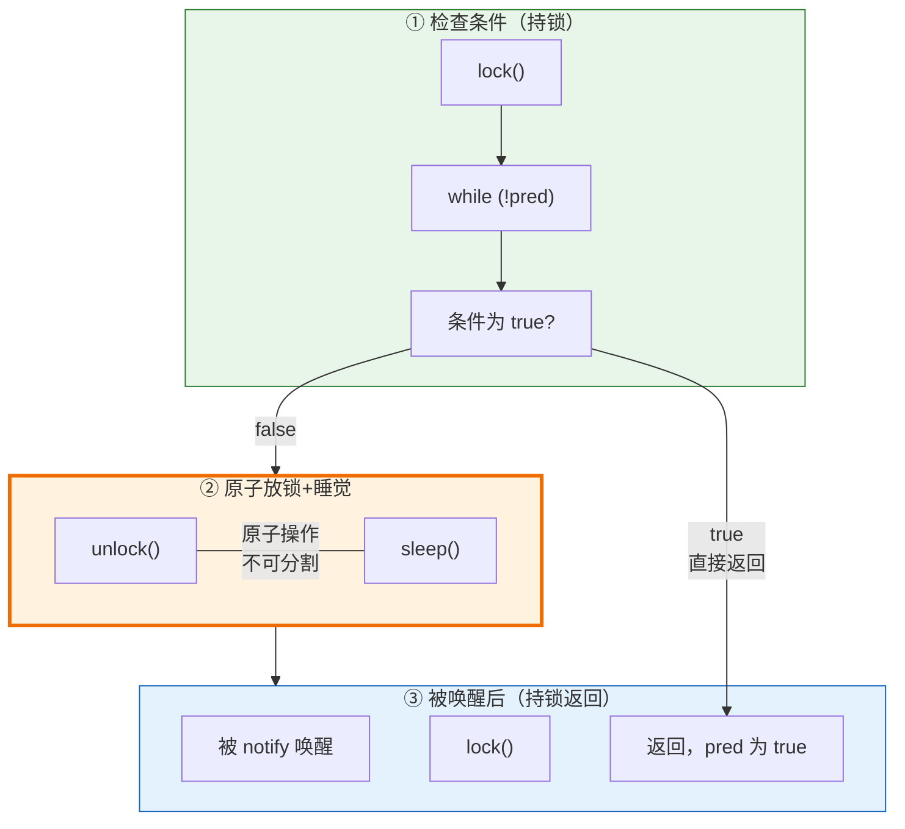
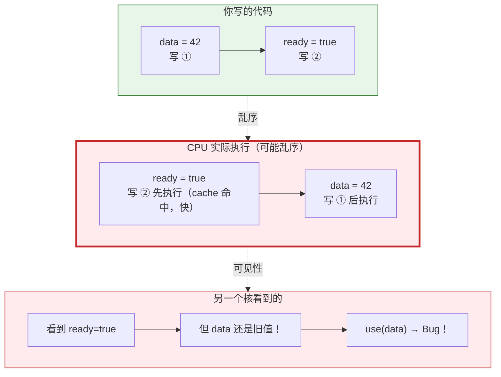
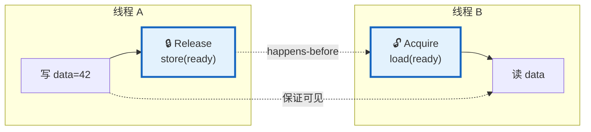

# 理论 05：同步原语与内存一致性

> 一句话：mutex 和 condition_variable 在底层是怎么实现的，以及为什么用了锁之后线程一定能看到最新数据——这是 Lab 2 Sleeping 版线程池的理论根基。

## 为什么你需要学这个

Lab 2 Part A Step 3（ThreadPoolSleeping）是得分最高、也最难正确实现的部分。你需要同时使用 `mutex`、`condition_variable`、`atomic`，并理解：

- 条件变量的 `wait()` 内部到底做了什么？为什么必须持锁？
- 为什么锁的 unlock 和 lock 构成了 happens-before 关系？
- 主线程写的数据，Worker 被唤醒后一定能看到吗？为什么？
- Spinning 版里的 `while(done < total){}` 安全吗？会不会被编译器优化掉？

---

## 核心概念

---

### 概念 1：锁的底层实现（Hardware Primitives for Locking）

**定义**

锁（Lock/Mutex）的底层实现依赖于硬件提供的原子 read-modify-write 指令，如 Test-and-Set（TAS）、Compare-and-Swap（CAS）和 Load-Linked/Store-Conditional（LL/SC，ARM 架构使用）。这些指令保证在多核环境下对同一内存地址的读取和修改是不可分割的原子操作，从而可以构建互斥语义。

**直觉**

```
你需要一个机制，让"检查门锁"和"锁上门"成为一个不可打断的动作。

没有原子操作：
  线程 A：看看锁是否空闲？ → 是
  （此刻 CPU 切换到线程 B）
  线程 B：看看锁是否空闲？ → 是
  线程 B：锁上！
  线程 A：锁上！
  → 两个线程都认为自己持有锁 → 灾难

有原子操作（Test-and-Set）：
  线程 A：原子地（检查 + 锁上）→ 成功，返回"之前是空闲的"
  线程 B：原子地（检查 + 锁上）→ 失败，返回"之前已被锁"
  → 只有 A 获得锁 → 正确
```

**机制**

> **一句话记忆法**
> 
> **TAS** = "直接抢，不管之前是啥" → `exchange(true)` 强制设为 true，看返回值  
> **CAS** = "先比较，符合条件才换" → `compare_exchange(expected, new)` 判断后交换

**记忆口诀：抢锁 vs 换锁**

```
TAS（Test-and-Set）= 霸道总裁式抢锁：
  "不管之前是谁的，我现在要设为 true，告诉我之前是不是 false"
  → exchange(old, new)：直接换，返回旧值
  → 如果旧值是 false → 我抢到了！
  → 如果旧值是 true  → 别人占着，我继续抢
  
CAS（Compare-and-Swap）= 条件交换式换锁：
  "只有当锁还是 expected 值时，我才换成 new"
  → compare_exchange(expected, new)：先比较再换
  → 符合预期 → 交换成功，返回 true
  → 不符合 → 失败，把 actual 值写回 expected
```

**Test-and-Set（TAS）——霸道抢锁：**

```cpp
class SpinLock {
    std::atomic<bool> locked_{false};
public:
    void lock() {
        while (locked_.exchange(true)) {
            // exchange 原子地将 locked_ 设为 true，返回旧值
            // 旧值为 true → 别人持有锁 → 继续自旋
            // 旧值为 false → 我获得了锁 → 退出循环
        }
    }
    void unlock() {
        locked_.store(false);
    }
};
```

**Compare-and-Swap（CAS）——条件换锁（更通用）：**

```cpp
void lock() {
    bool expected = false;
    while (!locked_.compare_exchange_weak(expected, true)) {
        expected = false;  // CAS 失败时 expected 被修改，需要重置
    }
}
```

**使用场景区别速查**

| 特性 | TAS (exchange) | CAS (compare_exchange) |
|:---|:---|:---|
| **语义** | 无条件交换，返回旧值 | 条件交换，比较后才换 |
| **适用** | 简单的锁获取/自旋 | ABA 问题处理、无锁数据结构 |
| **返回值** | 旧值（成功/失败看旧值）| true/false（成功否） |
| **失败时** | 无（总会成功）| expected 被更新为实际值 |

```
记忆锚点：
  CAS 的 C = Compare（先比较）
  CAS 的 S = Swap（再交换）
  
  TAS 没有 Compare，直接 Set（Test 其实是返回旧值让你判断）
```

**std::mutex 的实际实现（简化版）：**

```
std::mutex 不是纯自旋锁，它是"两阶段"策略：

阶段 1（用户态自旋）：
  尝试 CAS 获取锁
  失败 → 自旋若干次（通常几十到几百次）
  如果短时间内获得锁 → 无需进入内核，最快路径

阶段 2（内核态睡眠）：
  自旋仍未获得锁 → 调用 futex(FUTEX_WAIT) 系统调用
  线程进入内核等待队列，释放 CPU
  锁被释放时，持有者调用 futex(FUTEX_WAKE) 唤醒等待者

这就是为什么 std::mutex 在低竞争时几乎和自旋锁一样快，
但在高竞争时不会像纯自旋锁那样浪费 CPU。
```

**在 Lab 2 中的体现**

```
Spinning 版：不用 mutex，Worker 直接 fetch_add 抢任务（类似纯自旋）
Sleeping 版：用 mutex + condition_variable（内部是两阶段锁 + futex）

Sleeping 版中 lock/unlock 的开销：
  无竞争时：~25ns（纯用户态 CAS）
  有竞争时：~1-10μs（涉及内核态 futex）

这就是为什么 Sleeping 版每次 run() 的固定开销比 Spinning 版大，
但在轻量任务场景下总体更好——因为它不浪费 CPU。
```

---

### 概念 2：条件变量的内部机制

**定义**

一句话：**条件变量 = "睡等通知"机制——线程先释放锁去睡觉，被唤醒后再拿锁继续执行。核心 trick 是"放锁+睡觉"这两步必须是原子的，否则通知会在间隙里丢失。**

**直觉**

> **一句话记忆法**
> 
> **条件变量 = 快递员打电话模型**：告诉快递员"到了 call 我"，挂电话+睡觉必须一口气完成，否则快递来了你还没睡下，电话响了没接到 → 永远睡下去（死锁）。

```
没有条件变量 = 反复查快递（自旋）：
  while (快递没到) {
      开门看 → 没有 → 关门  // 累死人，浪费电（CPU）
  }

有条件变量 = 等电话（睡眠）：
  ① 给快递员留言："到了 call 我"   // predicate 告诉系统什么条件唤醒我
  ② 挂电话 + 立刻睡觉（原子！）      // unlock + sleep 原子化，防止 missed call
  ③ 电话响了 → 醒了 → 拿钥匙开门   // 被 notify → 重新 lock → 取快递
  
关键：步骤 ② "挂电话+睡觉"必须是原子的！
  ❌ 错误：先挂电话 → （快递员此时 call）→ 准备睡觉 → 错过 call → 永远睡下去
  ✅ 正确："挂电话并同时进入睡眠模式"是一步完成的
```

**机制三步曲**



**代码实现（伪代码）**

```cpp
void wait(unique_lock<mutex>& lk, function<bool()> pred) {
    while (!pred()) {              // ① 检查条件（必须持锁）
        // === 原子分割线 ===
        lk.unlock();                // ②a 放钥匙（释放锁）
        enqueue_and_sleep();         // ②b 去睡觉（挂起线程）
        // === 原子分割线 ===
        lk.lock();                   // ③ 醒来先拿钥匙（重新锁）
    }  // ④ 检查 pred，false 则继续睡，true 则持锁返回
}
```

**为什么必须持锁调用 wait？——防止 Missed Notification**

```
❌ 错误示范（不持锁检查条件）：
  Worker: 看一眼队列为空... 准备睡觉...
         ↑ 间隙！
  主线程:   塞入任务 → notify_all()
  Worker:   开始睡觉 → 错过 notify → 永远睡下去
  
✅ 正确示范（持锁检查）：
  Worker: lock() → 看一眼队列为空 → wait() 原子放锁睡觉
         ↑ 主线程必须等 lock 才能塞任务，要么：
         • Worker 看到任务（不需要 wait）
         • Worker 先睡了，主线程后 notify（能收到）
```

**为什么需要 predicate？——防止 Spurious Wakeup**

```
Spurious Wakeup = 系统"诈你"（没 notify 也把你叫醒）

原因：Linux 内核实现允许偶尔虚假唤醒（信号处理等）

❌ 无 predicate：
  cv.wait(lk);      // 被虚假唤醒
  // 假设条件满足 → 开始执行 → 结果条件其实不满足 → Bug！

✅ 有 predicate：
  cv.wait(lk, [&]{ return has_work || stop; });
  // 被虚假唤醒 → 检查 has_work? false → 继续睡（识破诈术）
  // 被真正 notify → 检查 has_work? true → 起床执行
  
记忆口诀："wait 一定要带 predicate，否则系统诈你！"
```

**在 Lab 2 中的体现**

```cpp
// Worker 线程睡觉等任务
cv_worker_.wait(lk, [this] {
    return next_task_id_ < num_total_tasks_ || stop_;
});

// 主线程做完任务通知
cv_done_.wait(lk, [this] {
    return tasks_done_ == num_total_tasks_;
});
```

| 条件变量 | 谁 wait | predicate 条件 | 谁 notify | 用 one/all |
|:---|:---|:---|:---|:---:|
| `cv_worker_` | 16 Workers | `有任务 || 停止` | 主线程 run() | **all** |
| `cv_done_` | 主线程 | `全部完成` | 最后 Worker | **one** |

```
记忆口诀：
  Worker 等任务 → "有活干或要关门"
  主线程等完成 → "全部干完"  
  放任务唤醒所有 → notify_all（多人可抢）
  完成只唤醒主线程 → notify_one（只有主线程等）
```

---

### 概念 3：内存一致性模型（Memory Consistency Model）

**定义**

内存一致性模型定义了多处理器系统中，一个处理器的内存操作对其他处理器可见的顺序约束。顺序一致性（Sequential Consistency, SC）要求所有处理器看到相同的全局内存操作顺序，且每个处理器的操作按程序顺序出现。宽松一致性模型（Relaxed Consistency）允许处理器对无依赖的内存操作进行重排序以提高性能，但需要显式的内存屏障（Memory Fence/Barrier）来在必要时强制顺序。

**直觉**

> **一句话记住问题**
> 
> CPU 为了性能会"乱序执行"——你写的 A→B→C，实际执行的可能是 B→A→C。其他核看到的顺序可能让你大吃一惊！

```
现实类比：朋友圈发文

  你发的两条朋友圈：
    ① "今天买了新房"  (data = 42)
    ② "准备好搬家了" (ready = true)
  
  正常顺序：朋友先看到 ①，再看到 ②
    → 朋友知道：新房已买好，可以准备搬家了 ✓
  
  CPU 乱序后：朋友先看到 ②，再看到 ①（或只看到 ②）
    → 朋友："准备好搬家了"？但你房子还没买啊？→ 困惑/错误！
    
  内存屏障 = "必须按顺序发布"的强制机制：
    Release 屏障："①必须先发布，才能发 ②"
    Acquire 屏障："看到 ② 时，必须同时看到 ①"
```

**乱序执行图示**



**机制**

**C++ 内存序三档速查**

| 档位 | Memory Order | 保证强度 | 性能 | 使用场景 |
|:---:|:---|:---:|:---:|:---|
| 🥉 最强 | `seq_cst` | 全局统一顺序 | 最慢 | **默认选择**，最安全 |
| 🥈 中等 | `acquire/release` | 成对 happens-before | 中等 | 生产者-消费者 |
| 🥇 最弱 | `relaxed` | 仅原子性 | 最快 | 纯计数器（不同步）|

**Acquire/Release 核心记忆法**

```
Release（释放）= "提交按钮"：
  按下去之前写的所有数据 → 对别人可见
  
  记忆：unlock() 是 Release
  "我把数据写好了，现在 unlock → 你们都能看到"

Acquire（获取）= "刷新按钮"：
  按下去之后读的数据 → 保证是最新的
  
  记忆：lock() 是 Acquire  
  "我先 lock → 刷新缓存 → 读到的一定是最新值"

口诀："Release 之前的写，Acquire 之后的读"
```

**屏障工作流程**



**在 Lab 2 中的体现**

> **好消息：Lab 2 全程用默认设置，不需要手动管理！**

```cpp
std::mutex::lock()           // 内含 Acquire
std::mutex::unlock()         // 内含 Release  
std::atomic<int> (默认)      // seq_cst（最强）
cv.wait() 返回后             // 内含 Acquire（重新 lock）
```

| 操作 | 内存语义 | 作用 |
|:---|:---|:---|
| `unlock()` | **Release** | 所有写入对后续 lock 可见 |
| `lock()` | **Acquire** | 保证看到其他线程的最新写入 |

```
Sleeping 版的 happens-before 链：
  主线程 unlock → Release → Worker lock → Acquire → Worker 看到最新数据
  
记忆：unlock 是"交钥匙"，lock 是"拿钥匙"，中间有 happens-before 保证
```

**Spinning 版的安全性速查**

```cpp
// ✅ 安全：atomic 默认 seq_cst
while (tasks_done_.load() < num_total_tasks_) {}

// ❌ 危险：普通 int 会被编译器优化
while (tasks_done_ < num_total_tasks_) {}  // 可能永远循环！
```

| 变量类型 | 是否安全 | 原因 |
|:---|:---:|:---|
| `std::atomic<int>` | ✅ | 默认 seq_cst，保证可见 |
| `volatile int` | ❌ | 只防编译器优化，不保证多核可见 |
| `int` | ❌ | 可能被缓存到寄存器，永远不看内存 |

```
一句话：Spinning 版必须用 atomic，否则编译器"优化掉"你的循环！
```

> **RDMA 映射**：RDMA Write 完成后，目标端 CPU 的缓存中可能还是旧数据（因为 DMA 绕过了 CPU cache）。这就是为什么 RDMA Write 后需要通过 `IBV_SEND_SIGNALED` + Completion 机制来确保目标端 CPU 看到最新数据。本质上是同一个"内存可见性"问题，只是 RDMA 涉及跨机器，而 Lab 2 在单机多核内。

---

### 概念 4：Happens-Before 关系

**定义**

Happens-Before 是并发程序中定义操作之间可见性和顺序的偏序关系。若操作 A happens-before 操作 B（记作 A ≺ B），则 A 的效果（包括所有内存写入）保证对 B 可见。Happens-before 关系可以通过以下方式建立：（1）同一线程内的程序顺序；（2）mutex 的 unlock ≺ 后续的 lock；（3）condition_variable 的 notify ≺ 对应的 wait 返回；（4）atomic store(release) ≺ 对应的 load(acquire)。

---

#### 四条建立规则（必须会背）

| 规则 | 形式 | 含义 | Lab 2 例子 |
|:---|:---|:---|:---|
| 程序顺序 | A 线程内 `x=1` 在 `y=2` 前 | 同线程内前写后读成立 | `run()` 中先写 `current_runnable_` 再 `unlock()` |
| 锁规则 | `unlock(m)` ≺ `lock(m)` | 解锁前写入，对后续拿到同一把锁的线程可见 | 主线程 `unlock(mtx_)` 后，Worker `lock(mtx_)` 读到新任务 |
| 条件变量 | `notify` ≺ 对应 `wait` 返回 | 通知发生后，等待线程返回 | 主线程 `notify_all()`，Worker 从 `wait` 返回 |
| 原子语义 | `store(release)` ≺ `load(acquire)` | release 前写入对 acquire 后读取可见 | `ready.store(true, release)` 与 `ready.load(acquire)` |

一句话记忆：**没有同步点，就没有跨线程可见性保证。**

> **四条规则的分工澄清**
>
> 容易让人疑惑的是：`notify ≺ wait返回` 和 `unlock ≺ lock` 同时出现，它们各自负责什么？
>
> | 规则 | 负责的问题 | 没有它会怎样 |
> |:---|:---|:---|
> | `unlock ≺ lock` | **数据可见性**：A 锁内写的东西，B 拿锁后能读到 | B 拿到锁，但读到的是旧值 |
> | `notify ≺ wait返回` | **控制流顺序**：B 醒来是因为 A 真的 notify 了 | B 永远睡着，或莫名其妙乱醒 |
>
> 两者是**搭档关系，各司其职，缺一不可**：
> - 只有 mutex 没有 CV → 数据安全，但 B 只能轮询（反复 lock→检查→unlock）
> - 只有 CV 没有 mutex → B 能被叫醒，但看到的数据不一定正确
>
> `notify ≺ wait返回` 还有一个独立贡献：它是 HB 链的**中间桥梁**。例如在原子变量场景下：
> ```
> store(release) ≺ notify ≺ wait返回 ≺ load(acquire)
> ```
> 这里 `notify ≺ wait返回` 连接了 A 的 release 写入和 B 的 acquire 读取，去掉这一环链条就断了。
> 不过对 Lab 2 而言，这属于高级用法，了解即可。

---

#### Lab 2 的标准 HB 链条（Sleeping 版）

把 `run()` 和 Worker 交互抽象成这 6 步：

```text
主线程: 写任务元数据
   ≺
主线程: unlock(mtx_)   [Release]
   ≺
主线程: notify_all(cv_worker_)
   ≺
Worker : wait(cv_worker_) 返回
   ≺
Worker : lock(mtx_)     [Acquire]
   ≺
Worker : 读任务元数据并执行 runTask()
```

你真正要记住的是这句：**写在 unlock 之前，读在后续 lock 之后。**

---

#### 为什么这条链是“够用且正确”的

1. `unlock ≺ lock` 给了跨线程**数据可见性**（核心保证）——写在解锁前，读在加锁后，数据一定最新。
2. `notify ≺ wait返回` 给了**唤醒时序**——保证 B 醒来是因为 A 真的发出了通知，而非乱醒；同时也是 HB 链中不可缺少的传递节点。
3. 两条链叠加后，Worker 醒来并重新拿锁时，读到的是主线程写好的任务数据。

这也是为什么 `wait` 一定要和同一把 `mutex` 搄配使用：**叫醒归 CV 负责，数据可见归 mutex 负责**，少了任何一方，整条链都不完整。

---

#### 最常见误区：锁外写共享变量

```cpp
// ❌ 错误：锁外写导致 happens-before 链断裂
void run(IRunnable* runnable, int total) {
    current_runnable_ = runnable;      // 🔴 锁外！Worker 可能永远读不到
    {
        std::lock_guard<std::mutex> lk(mtx_);
        num_total_tasks_ = total;        // 锁内
    }
    cv_worker_.notify_all();
}
// 问题：current_runnable_ 的写入不在 happens-before 链中
//       Worker 唤醒后可能看到 nullptr，导致崩溃

// ✅ 正确：全部在锁内，完整 happens-before 链
void run(IRunnable* runnable, int total) {
    std::lock_guard<std::mutex> lk(mtx_);
    current_runnable_ = runnable;        // 🟢 锁内 ✓
    num_total_tasks_ = total;            // 🟢 锁内 ✓
    // unlock 时自动 Release，notify 时 Worker 保证能看到
}
// 保证：Worker 被唤醒后，current_runnable_ 和 num_total_tasks_ 一定是最新值
```

| 写法 | HB 链条 | 可见性 | 风险 |
|:---|:---:|:---:|:---|
| 锁外写 + 锁内写混用 | 断裂 | 不确定 | 随机旧值、难复现 Bug |
| 共享状态全部锁内写 | 完整 | 有保证 | 正确 |

---

#### 记忆卡（面试/实现都可用）

```text
HB = 可见性契约

四条规则：
1) 程序顺序
2) unlock ≺ lock
3) notify ≺ wait返回
4) release ≺ acquire

Lab 2 口诀：
写 → 解锁 → 通知 → 醒来 → 加锁 → 读

工程规则：
共享状态统一在同一把锁内修改
```

---

### 概念 5：notify_one vs notify_all 的选择

**定义**

`notify_one()` 唤醒等待在条件变量上的**一个**线程（如果有的话），`notify_all()` 唤醒**所有**等待的线程。选择哪个取决于：有多少个等待者可能因为条件变为真而应该被唤醒。如果只有一个等待者的条件会变为真，使用 `notify_one` 更高效；如果多个等待者的条件可能同时变为真，必须使用 `notify_all` 以避免遗漏。

**直觉**

```
notify_one = 喊一个人起床
notify_all = 拉响所有人的闹钟

什么时候用 notify_one：
  你刚做好 1 份饭 → 只需叫 1 个人来吃
  
什么时候用 notify_all：
  你刚放了 100 个任务进队列 → 所有空闲 Worker 都应该醒来抢活干
```

**机制**

Lab 2 中的两个通知场景：

```
场景 1：run() 提交新任务 → 用 notify_all
  原因：新任务有多个（num_total_tasks 可能很大），
       所有空闲 Worker 都应该醒来同时处理。
       如果用 notify_one，只唤醒 1 个 Worker，其余继续睡，
       导致并行度远低于预期。

场景 2：最后一个 task 完成，通知主线程 → 用 notify_one
  原因：只有一个主线程在 cv_done_.wait() 等待。
       notify_one 就够了，notify_all 也不会错（只是多余）。

场景 3：析构函数，通知所有 Worker 退出 → 用 notify_all
  原因：所有 Worker 都需要被唤醒以检查 stop_ 标志并退出循环。
```

**常见错误：在 run() 提交任务时用了 notify_one**

```
错误表现：
  16 个 Worker，提交了 1000 个 task
  notify_one → 只唤醒 1 个 Worker
  这个 Worker 做完 1 个 task 后...没人 notify 其他 Worker
  → 只有 1 个 Worker 在干活，其余 15 个在睡觉
  → 性能退化为接近串行
  
  （除非 Worker 完成 task 后会 notify 其他 Worker——
   但这增加了实现复杂度，不如直接 notify_all 简单可靠）
```

**在 Lab 2 中的体现**

简单策略：

```
run() 中：notify_all（唤醒所有 Worker）
task 完成且 tasks_done_ == total：notify_one（只通知主线程）
析构中：notify_all（唤醒所有 Worker 退出）
```

这个策略不是性能最优的（可能存在"惊群效应"——唤醒了 16 个 Worker 但只有 3 个 task），但对 Lab 2 的规模足够好，且实现最简单。

---

## 关键结论

- [ ] `std::mutex` 底层是 CAS + futex 的两阶段实现，低竞争时很快（~25ns）
- [ ] `condition_variable::wait()` 原子地释放锁并挂起线程，这个原子性防止了 lost wakeup
- [ ] `wait()` 必须带 predicate，因为 spurious wakeup 在 Linux 上是真实存在的
- [ ] `mutex` 的 lock/unlock 自带 acquire/release 语义，保证跨线程的数据可见性
- [ ] 共享变量的修改必须在同一把锁内完成，否则 happens-before 链断裂，可能读到旧值
- [ ] `notify_one` 适合“只有一个消费者需要响应”的场景；`notify_all` 适合“所有等待者都需要重新检查条件”的场景（如广播状态变化）
- [ ] mutex（`unlock ≺ lock`）负责**数据可见性**，condition_variable（`notify ≺ wait返回`）负责**唤醒时序**，两者是搄伴关系，缺一不可
- [ ] 默认优先使用 `seq_cst`（`std::mutex` + 默认 `atomic`），只在性能瓶颈明确时才引入 `acquire/release` 等弱序模型——弱序模型极难正确推理，出 bug 多且难复现

---

## 自测

**[判断题 1]**
T/F：`std::mutex` 的性能在任何情况下都比 `std::atomic` 的 CAS 操作差。

<details>
<summary>答案</summary>

**F（错误）**。在无竞争时，`std::mutex::lock()` 只是一次 CAS（~25ns），和直接用 atomic CAS 差不多。mutex 开销主要在高竞争时的内核态 futex 调用。

但 mutex 的优势是：当竞争激烈时，等待的线程会进入内核睡眠而非自旋，不浪费 CPU。纯 atomic CAS 自旋在高竞争时会浪费大量 CPU 资源。
</details>

---

**[判断题 2]**
T/F：在 Lab 2 的 Spinning 版中，`tasks_done_` 必须是 `std::atomic<int>` 而非普通 `int`，即使它已经被 volatile 修饰。

<details>
<summary>答案</summary>

**T（正确）**。`volatile` 只告诉编译器"不要优化掉这个读取"，但不提供以下保证：（1）原子性（`int++` 在多线程下仍可能丢失更新），（2）内存顺序（编译器和 CPU 仍可能重排与其他变量的读写顺序）。`std::atomic<int>` 同时提供原子性和内存序保证。

在 C++ 标准中，`volatile` 从来不是为多线程同步设计的（它是为内存映射 I/O 设计的），不能替代 `atomic`。
</details>

---

**[思考题]**
以下 Sleeping 版 Worker 循环有一个微妙的 Bug，你能找到吗？

```cpp
void worker_loop() {
    while (true) {
        std::unique_lock<std::mutex> lk(mtx_);
        cv_worker_.wait(lk, [this]{ return has_work_ || stop_; });
        if (stop_) return;
        
        int id = next_task_id_++;
        if (id >= num_total_tasks_) continue;  // 没抢到任务
        
        lk.unlock();
        current_runnable_->runTask(id, num_total_tasks_);
        lk.lock();
        
        tasks_done_++;
        if (tasks_done_ == num_total_tasks_) {
            has_work_ = false;
            cv_done_.notify_one();
        }
    }
}
```

<details>
<summary>分析</summary>

**Bug 在 `continue` 那一行。**

当 `id >= num_total_tasks_` 时，执行 `continue` 跳回循环顶部。但此时 `lk` 仍然持有锁（因为还没有调用 `lk.unlock()`）。回到循环顶部后，`std::unique_lock<std::mutex> lk(mtx_)` 会尝试再次 lock 一个已经被自己持有的 `mtx_` → **死锁**（std::mutex 不是递归锁）。

等等，实际上 `unique_lock` 在 `continue` 时离开作用域再重新进入，会先析构（unlock）再构造（lock），所以不会死锁。

真正的 Bug 更微妙：当 `id >= num_total_tasks_` 时 `continue`，线程会回到 `cv_worker_.wait()`。但 `has_work_` 仍然为 true（还没有被任何人重置为 false），所以 predicate 立即为 true，`wait` 不会阻塞，线程又执行 `next_task_id_++`，拿到一个更大的无效 id，又 `continue`...

**结果是无限循环地递增 `next_task_id_` 而不做任何有用功**，直到其他 Worker 完成所有 task 并将 `has_work_` 设为 false。

修复：在 `continue` 之前不要无条件回到 wait，或者让 predicate 更精确地检查是否还有未分配的 task。

这个例子说明：**predicate 的设计必须精确反映"是否真的有工作可做"，而不只是"run() 是否被调用过"。**
</details>

---

**[代码预测题]**
以下代码在多线程环境下是否安全？为什么？

```cpp
int data = 0;
std::atomic<bool> ready{false};

// 线程 A
data = 42;
ready.store(true);  // 默认 memory_order_seq_cst

// 线程 B
while (!ready.load()) {}  // 默认 memory_order_seq_cst
assert(data == 42);       // 这个 assert 会失败吗？
```

<details>
<summary>分析</summary>

**安全，assert 不会失败。**

原因：`ready.store(true)` 使用默认的 `memory_order_seq_cst`，它同时包含 release 语义。`ready.load()` 同样是 `seq_cst`，包含 acquire 语义。

happens-before 链：
- `data = 42` ≺ `ready.store(true)`（同一线程，程序顺序）
- `ready.store(true)` ≺ `ready.load()` 返回 true（seq_cst store ≺ load）
- `ready.load()` ≺ `assert(data == 42)`（同一线程，程序顺序）

所以 `data = 42` happens-before `assert(data == 42)`，B 一定看到 42。

但如果把 store/load 改为 `memory_order_relaxed`，就不安全了——relaxed 不建立 happens-before 关系，B 可能看到 `data` 的旧值 0。

这就是为什么 Lab 2 中统一使用默认的 `atomic`（seq_cst）是最安全的选择。
</details>
